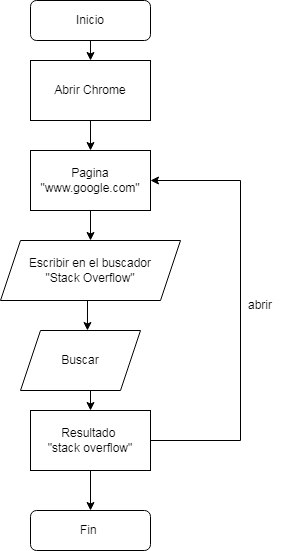

# EXTENSION DE GOOGLE CHROME

A continuacion se presentaran dos ejemplos sencillos de como podemos crear una extension para chrome


## 


## EJEMPLO 1


En este ejemplo vamos a crear una extension de diga "Hello Extensions".

Creamos una carpeta la cual va a contener nuestros archivos de la extension los cuales son manifest.json y hello.html.

El archivo manifest.json tendra el siguiente codigo
```
{
  "manifest_version": 3,
  "name": "Hello Extensions",
  "description": "Base Level Extension",
  "version": "1.0",
  "action": {
    "default_popup": "hello.html",
    "default_icon": "hello_extensions.png"
  }
}
```
**manifest_version:** es la version de nuestro manifiesto en este caso es la ultima version que hay la cual es la 3. 

**name:** es el nombre quue va a llevar nuestra extension.

**description:** Es una breve descripcion de la extension.

**version:** es la version de la estension no confundir con la version del manifiesto.

**action:** lo que hace esta parte del condigo es llamar lo que esta dentro de los corchetes.


El archivo hello.html tendra una estructura basica de html con el siguiente codigo
```
<html>
  <body>
    <h1>Hello Extensions</h1>
  </body>
</html>
```
## EJEMPLO 2



En este ejemplo vamos a crear una extension de diga que haga una busqueda cada vez que abramos el buscador de google

Creamos una carpeta la cual va a contener nuestros archivos para este ejemplo utilizaremos tres archivos  los cuales son manifest.json, buscaGoogle.js y backgroud.js

El archivo manifest.json tendra el siguiente codigo
```
{
    "manifest_version": 3,
    "name": "Buscar en google",
    "description": "Buscar en Google",
    "version": "1",
    "icons": {
      "128": "icon_128.png"
    },
    "permissions": [
      "storage",
      "activeTab",
      "scripting",
      "tabs"
    ],
    "background": {
      "service_worker": "background.js"
    },
    "host_permissions": [
      "https://www.google.com/*"
      
    ]
  }
```
**manifest_version:** es la version de nuestro manifiesto en este caso es la ultima version que hay la cual es la 3. 

**name:** es el nombre quue va a llevar nuestra extension.

**description:** Es una breve descripcion de la extension.

**version:** es la version de la estension no confundir con la version del manifiesto.

**Permissions:** esta parte son los permisos que le vamos a dar a la extension.

- storage
- activeTab: permite manipular la pestaña en la que estamos 
- scripting: nos permite ingresar codigo a nuestra tab
- tabs: permite manipular tab 

**host_permissions:** Esta parte es donde le estamos danto permiso a nuestra extension de ejecutarse.

El archivo backgroud.js con el siguiente codigo
```
chrome.tabs.onUpdated.addListener((tabId, changeInfo, tab) => {
    if (changeInfo.status === 'complete' && /^http/.test(tab.url)) {
        chrome.scripting.executeScript({
            target: { tabId: tabId },
            files: ["./buscaGoogle.js"]
        })
            .then(() => {
                console.log("INJECTED THE FOREGROUND SCRIPT.");
            })
            .catch(err => console.log(err));
    }
});
```
Cuando nuestra tab se actualice mandamos a llamar un evento y validamos si se han generado cambios, comprueba que si la url que escribimos corresponde a la misma a la que le dimos permiso en nuestro caso google.

Ejecuta el script el cual escribe de manera automatica en el buscador "stack overflow" y le da click en buscar.
## Implementacion

- Abrimos nuestro navegador de Chrome
- En la parte superior derecha damos click en los tres puntos
- Luego vamos donde dice mas herramientas
- Despues donde dice extensiones
- Activamos donde dice modo desarrollador 
- Damos click donde dice Cargar descomprimida 
- Buscamos la carpeta que creamos al inicio donde se encuentran nuestros archivos y aceptamos 
- Listo ya quedo implementada nuestra extension.


## Documentation

[Soporte de Google](https://support.google.com/chrome/a/answer/2714278?hl=es#:~:text=Ve%20a%20chrome%3A%2F%2Fextensions,de%20la%20aplicaci%C3%B3n%20o%20extensi%C3%B3n.)


## Contribuciones

[Programador novato](https://www.youtube.com/watch?v=HHrX5Mi0JqU).

[matiassingers/awesome-readme](https://github.com/matiassingers/awesome-readme).

## Herramientas

[Readme.so](https://readme.so/es).

